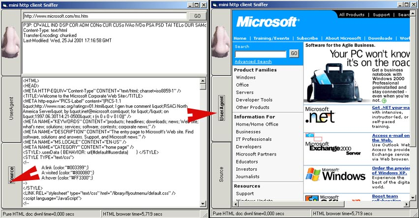

<div align="center">

## a \*\* PURE VB \*\* HTTP Client Sniffer


</div>

### Description

A simple program in PURE VB to "sniff" HTTP response to the client.

This cute application includes the page visualizzation in the browser tab (see the screenshot)
 
### More Info
 
A user must only knows what HTTP is. This program help he to read HTTP responses and response headers cfor a given URL.


<span>             |<span>
---                |---
**Submitted On**   |2001-07-25 19:58:24
**By**             |[aldus](https://github.com/Planet-Source-Code/PSCIndex/blob/master/ByAuthor/aldus.md)
**Level**          |Beginner
**User Rating**    |4.7 (61 globes from 13 users)
**Compatibility**  |VB 4\.0 \(32\-bit\), VB 5\.0, VB 6\.0
**Category**       |[Internet/ HTML](https://github.com/Planet-Source-Code/PSCIndex/blob/master/ByCategory/internet-html__1-34.md)
**World**          |[Visual Basic](https://github.com/Planet-Source-Code/PSCIndex/blob/master/ByWorld/visual-basic.md)
**Archive File**   |[a \_\_ PURE 234877252001\.zip](https://github.com/Planet-Source-Code/aldus-a-pure-vb-http-client-sniffer__1-25486/archive/master.zip)

### API Declarations

```
'Nothing of nothig.
'This is only PURE VB, in my programming style.
```


